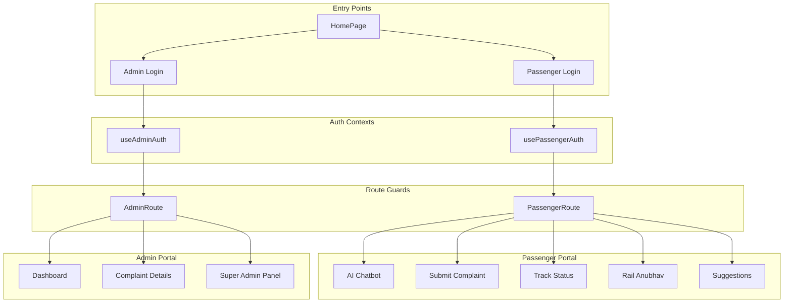
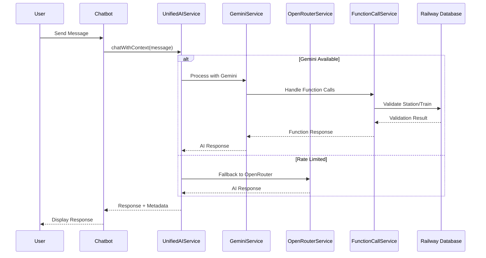

<div align="center">

  

  <h1>🚂 RailMadad AI</h1>
  
  <p>
    <strong>Next-Gen AI-Powered Grievance Redressal for Indian Railways</strong>
  </p>

  <p>
    <a href="#-features">Features</a> •
    <a href="#-demo-credentials">Demo</a> •
    <a href="#-installation">Installation</a> •
    <a href="#-tech-stack">Tech Stack</a> •
    <a href="#-architecture">Architecture</a> •
    <a href="#-ai-capabilities">AI</a> •
    <a href="#-contributing">Contributing</a>
  </p>

  <p>
    
    
    
    
    
  </p>

  <p>
    
    
    
  </p>

</div>

<br />

## 📋 Overview

**RailMadad AI** is a modern, AI-powered grievance redressal platform reimagining how passengers interact with Indian Railways. Built with cutting-edge technologies, it provides an intelligent, multilingual chatbot that handles complaints, enquiries, and suggestions through natural conversation.

<table>
  <tr>
    <td width="50%">
      <h3>🎯 Key Highlights</h3>
      <ul>
        <li><strong>🤖 AI-First Architecture</strong>: Powered by Google Gemini 3 Flash Preview with native function calling for precise data extraction.</li>
        <li><strong>🌐 Multilingual Support</strong>: Fluent in Hindi, English, and regional Indian languages.</li>
        <li><strong>🔊 Multimodal Input</strong>: Accepts voice, text, images, and file attachments.</li>
        <li><strong>📊 Real-time Validation</strong>: Cross-references against official Indian Railway databases (7000+ stations, 12000+ trains).</li>
        <li><strong>🛡️ Role-Based Portals</strong>: Separate secure environments for Passengers, Officials, and Super Admins.</li>
        <li><strong>🔄 Multi-Provider Fallback</strong>: Automatic failover between Gemini and OpenRouter APIs.</li>
      </ul>
    </td>
    <td width="50%">
      <h3>🚀 Tech Stack at a Glance</h3>
      <ul>
        <li><strong>Frontend</strong>: React 19 + Vite 7</li>
        <li><strong>Language</strong>: TypeScript 5.9</li>
        <li><strong>Styling</strong>: Tailwind CSS 3.4 + Shadcn UI + Radix</li>
        <li><strong>AI Engine</strong>: Gemini 3 Flash Preview (Primary) / Gemini 2.5</li>
        <li><strong>Fallback AI</strong>: OpenRouter (multi-model)</li>
        <li><strong>Database</strong>: Supabase / SQLite / LocalStorage</li>
        <li><strong>Icons</strong>: Lucide + Tabler Icons</li>
      </ul>
    </td>
  </tr>
</table>

---

## ✨ Features

<table width="100%">
  <tr>
    <th width="33%">👤 For Passengers</th>
    <th width="33%">👮 For Railway Officials</th>
    <th width="34%">🔐 For Super Admins</th>
  </tr>
  <tr>
    <td valign="top">
      <ul>
        <li>🗣️ <strong>AI Chatbot</strong>: Natural conversation for filing complaints</li>
        <li>🎤 <strong>Voice Input</strong>: Speech-to-text for accessibility</li>
        <li>📎 <strong>Evidence Upload</strong>: Attach photos/documents in chat</li>
        <li>🔍 <strong>Track Complaints</strong>: Real-time status updates</li>
        <li>🎫 <strong>Rail Anubhav</strong>: Share travel experiences</li>
        <li>❓ <strong>Smart Enquiry</strong>: Instant answers to railway queries</li>
        <li>💡 <strong>Suggestions</strong>: Submit improvement ideas</li>
        <li>📝 <strong>Auto-Fill Forms</strong>: AI extracts details from conversation</li>
      </ul>
    </td>
    <td valign="top">
      <ul>
        <li>📊 <strong>Admin Dashboard</strong>: Centralized command center</li>
        <li>📈 <strong>Analytics</strong>: Visual insights with Recharts</li>
        <li>🏷️ <strong>Auto-Categorization</strong>: AI tags complaints automatically</li>
        <li>👥 <strong>Smart Routing</strong>: Auto-assigns to departments</li>
        <li>⚡ <strong>Priority Detection</strong>: Urgent cases flagged instantly</li>
        <li>🔔 <strong>Status Updates</strong>: Streamlined response workflow</li>
        <li>🔍 <strong>Search & Filter</strong>: Advanced complaint filtering</li>
        <li>📋 <strong>Detailed Views</strong>: Full complaint context</li>
      </ul>
    </td>
    <td valign="top">
      <ul>
        <li>⚙️ <strong>AI Configuration</strong>: Switch providers on-the-fly</li>
        <li>🔑 <strong>API Key Management</strong>: Secure key storage</li>
        <li>👥 <strong>User Management</strong>: Create/edit user accounts</li>
        <li>🩺 <strong>System Health</strong>: Monitor application status</li>
        <li>🛠️ <strong>Maintenance Mode</strong>: Toggle system availability</li>
        <li>📊 <strong>Rate Limit Monitor</strong>: Track API usage</li>
        <li>🔄 <strong>Provider Fallback</strong>: Configure backup AI services</li>
        <li>📝 <strong>Audit Logs</strong>: Track system changes</li>
      </ul>
    </td>
  </tr>
</table>

---

## Redesigned Logo
  
A redesigned logo for RailMadad is available at the following URL:

**[https://raw.githubusercontent.com/JaivishChauhan/RailMadad/refs/heads/main/public/favicon/RMLogo.png](https://raw.githubusercontent.com/JaivishChauhan/RailMadad/refs/heads/main/public/favicon/RMLogo.png)**

---

## 🧠 AI Capabilities

### Core AI Features

| Capability                        | Description                                                                                        |
| --------------------------------- | -------------------------------------------------------------------------------------------------- |
| **🚨 Emergency Detection**        | Instantly flags security threats, medical emergencies, or safety concerns for immediate escalation |
| **✅ Real-time Validation**       | Cross-references station codes, train numbers, PNR, and UTS against official Railway databases     |
| **📝 Structured Extraction**      | Uses Gemini function calling to convert free-text into structured JSON complaint data              |
| **🔄 Context Awareness**          | Maintains conversation history and user context for natural multi-turn dialogue                    |
| **🔀 Intelligent Mode Switching** | Automatically switches between Complaint, Enquiry, Tracking, and Suggestion modes                  |
| **🎯 Smart Categorization**       | AI determines complaint category, sub-category, and priority automatically                         |
| **🌐 Language Agnostic**          | Responds in the same language the user communicates in (Hindi, English, regional)                  |

### AI Function Calling Tools

```typescript
// 🚉 Station Validation
geminiValidateStation(stationInput: string): ValidationResult

// 🚆 Train Validation
geminiValidateTrain(trainInput: string): ValidationResult

// 🎫 PNR Validation
geminiValidatePNR(pnrInput: string): ValidationResult

// 🎟️ UTS Validation
geminiValidateUTS(utsInput: string): ValidationResult

// 📍 Zone Validation
geminiValidateZone(zoneInput: string): ValidationResult

// 🔄 Context Mode Switch
switchChatMode(mode: 'tracking' | 'enquiry' | 'suggestions' | 'railanubhav'): void

// 📋 Complaint Submission
submitComplaint(complaintData: ComplaintPayload): SubmissionResult
```

### Multi-Provider Architecture

```
┌─────────────────────────────────────────────────────────────┐
│                    Unified AI Service                       │
├─────────────────────────────────────────────────────────────┤
│                                                             │
│  ┌───────────────┐  Rate Limit?    ┌──────────────────┐  │
│  │    Gemini     │ ───────────────▶│    OpenRouter    │  │
│  │ 3 Flash Prev. │                 │  (Multi-Model)   │  │
│  └───────────────┘                 └──────────────────┘  │
│         │                                   │             │
│         ▼                                   ▼             │
│  ┌───────────────┐                 ┌──────────────────┐   │
│  │    Gemini     │                 │   Free Models    │   │
│  │  2.5 Flash    │                 │   (Fallback)     │   │
│  └───────────────┘                 └──────────────────┘   │
│                                                             │
└─────────────────────────────────────────────────────────────┘
```

---

## 🎬 Demo Credentials

> **Note**: Demo accounts are automatically seeded on application startup via LocalStorage.

<div align="center">

| Role               | Email                           | Password   | Access Level                 |
| ------------------ | ------------------------------- | ---------- | ---------------------------- |
| **👤 Passenger**   | `passenger@demo.com           ` | `demo123`  | Full Passenger Portal        |
| **👨‍💼 Admin**       | `test.admin@railmadad.demo`     | `admin123` | Station/Zone Admin Dashboard |
| **🛡️ Moderator**   | `test.moderator@railmadad.demo` | `mod123`   | Content Moderation           |
| **🔐 Super Admin** | `super.admin@railmadad.demo`    | `super123` | Full System Configuration    |

</div>

---

## 🚀 Installation

### Prerequisites

- **Node.js** 18+ (LTS recommended)
- **pnpm** 8+ (recommended) or npm/yarn
- **Gemini API Key** ([Get one here](https://aistudio.google.com/app/api-keys))

### ⚡ Quick Start

```bash
# 1. Clone the repository
git clone https://github.com/JaivishChauhan/RailMadad.git
cd RailMadad

# 2. Install dependencies
pnpm install

# 3. Configure Environment
cp .env.example .env
# Add your API keys to .env file

# 4. Start development server
pnpm dev
```

The app will be available at `http://localhost:5173`

### 🔧 Environment Variables

| Variable             | Required | Description                                 |
| -------------------- | :------: | ------------------------------------------- |
| `GEMINI_API_KEY`     |    ✅    | Google Gemini API Key (primary AI provider) |
| `OPENROUTER_API_KEY` |    ❌    | OpenRouter API Key (fallback provider)      |

### 📦 Available Scripts

```bash
pnpm dev          # Start development server
pnpm build        # Build for production
pnpm preview      # Preview production build
pnpm init-db      # Initialize SQLite database
pnpm migrate-db   # Run database migrations
pnpm setup-rag    # Setup RAG knowledge base
```

---

## 🛠️ Tech Stack

<table width="100%">
  <tr>
    <td align="center"><strong>Frontend</strong></td>
    <td align="center"><strong>AI & Backend</strong></td>
    <td align="center"><strong>UI Components</strong></td>
    <td align="center"><strong>Tooling</strong></td>
  </tr>
  <tr>
    <td align="center">
      <br/>
      React 19 • TypeScript 5.9<br/>
      Vite 7 • Tailwind 3.4
    </td>
    <td align="center">
      <br/>
      Gemini 3 • OpenRouter<br/>
      Supabase • SQLite • BetterSQLite3
    </td>
    <td align="center">
      Shadcn UI • Radix<br/>
      Lucide Icons • Tabler Icons<br/>
      Recharts • React Markdown
    </td>
    <td align="center">
      <br/>
      pnpm • ESBuild<br/>
      PostCSS • Autoprefixer
    </td>
  </tr>
</table>

### Key Dependencies

| Package                 | Version | Purpose                    |
| ----------------------- | ------- | -------------------------- |
| `@google/generative-ai` | 0.24+   | Gemini AI SDK              |
| `@google/genai`         | 1.34+   | Gemini native SDK (new)    |
| `react-router-dom`      | 7.11+   | Client-side routing        |
| `@supabase/supabase-js` | 2.89+   | Database client            |
| `better-sqlite3`        | 12.5+   | Local SQLite database      |
| `recharts`              | 2.15+   | Dashboard analytics charts |
| `react-markdown`        | 10.1+   | Markdown rendering in chat |
| `remark-gfm`            | 4.0+    | GitHub Flavored Markdown   |

---

## 🏗️ Architecture

### 📂 Project Structure

<details>
<summary>Click to expand full structure</summary>

```
railmadad/
├── src/
│   ├── components/              # 🧩 Reusable UI Components
│   │   ├── ui/                  # Shadcn/Radix primitives (30+ components)
│   │   ├── layout/              # Layout wrappers (PublicLayout, Footer)
│   │   ├── admin/               # Admin-specific components
│   │   ├── icons/               # Custom SVG icons
│   │   ├── providers/           # Context providers
│   │   ├── Chatbot.tsx          # 🤖 Main AI Chatbot (2000+ lines)
│   │   ├── ApiKeyPopup.tsx      # API key configuration modal
│   │   └── AuthDebugPanel.tsx   # Development auth debugger
│   │
│   ├── pages/                   # 📄 Application Routes
│   │   ├── admin/               # Admin portal pages
│   │   │   ├── AdminDashboardPage.tsx
│   │   │   └── AdminComplaintDetailPage.tsx
│   │   ├── passenger/           # Passenger portal pages
│   │   │   ├── SubmitComplaintPage.tsx
│   │   │   ├── ComplaintStatusPage.tsx
│   │   │   ├── TrackComplaintPage.tsx
│   │   │   ├── SuggestionsPage.tsx
│   │   │   └── EditComplaintPage.tsx
│   │   ├── HomePage.tsx
│   │   ├── LoginPage.tsx
│   │   ├── RailAnubhavPage.tsx
│   │   └── FaqPage.tsx
│   │
│   ├── services/                # ⚙️ Business Logic Layer
│   │   ├── geminiService.ts     # Primary AI integration (3000+ lines)
│   │   ├── unifiedAIService.ts  # Multi-provider abstraction
│   │   ├── openRouterService.ts # OpenRouter fallback
│   │   ├── functionCallService.ts # Gemini function calling
│   │   ├── stationValidationService.ts
│   │   ├── trainValidationService.ts
│   │   ├── trackingService.ts
│   │   ├── enquiryService.ts
│   │   ├── suggestionService.ts
│   │   ├── railAnubhavService.ts
│   │   ├── userContextService.ts
│   │   ├── contextEnhancer.ts
│   │   ├── contextLoader.ts
│   │   ├── localAuthService.ts
│   │   └── database.ts
│   │
│   ├── hooks/                   # 🎣 Custom React Hooks
│   │   ├── usePassengerAuth.tsx # Passenger authentication
│   │   ├── useAdminAuth.tsx     # Admin authentication
│   │   ├── useComplaints.tsx    # Complaint CRUD operations
│   │   ├── useUserAwareness.tsx # User context tracking
│   │   ├── useSessionContext.tsx
│   │   ├── useI18n.tsx          # Internationalization
│   │   └── usePlugins.tsx       # Plugin system
│   │
│   ├── data/                    # 💾 Static Data & Context
│   │   ├── contexts/            # AI context markdown files
│   │   ├── stationsData.ts      # Station database loader
│   │   ├── trainsData.ts        # Train database loader
│   │   ├── complaintData.ts     # Complaint categories
│   │   ├── railwayZones.ts      # Zone definitions
│   │   └── geminiContext.ts     # Core AI context
│   │
│   ├── config/                  # 🔧 Configuration
│   │   ├── aiConfig.ts          # AI provider configuration
│   │   └── index.ts             # App configuration
│   │
│   ├── lib/                     # 📚 Utility Libraries
│   │   └── utils.ts             # Tailwind merge utilities
│   │
│   ├── utils/                   # 🛠️ Helper Utilities
│   │   ├── logger.ts            # Logging configuration
│   │   ├── silenceConsole.ts    # Console noise reduction
│   │   └── i18nSetup.ts         # i18n initialization
│   │
│   ├── App.tsx                  # Root application component
│   ├── index.tsx                # Application entry point
│   └── types.ts                 # TypeScript definitions
│
├── public/
│   └── data/                    # 🚂 Railway JSON Datasets
│       ├── indian-railway-stations-2025-08-16.json
│       ├── indian-railways-trains-2025-08-16.json
│       └── metadata.json
│
├── database/                    # 💾 Database Files
│   ├── migrations/              # Schema migrations
│   └── setup/                   # Setup scripts
│
├── scripts/                     # 🛠️ Utility Scripts
│   ├── init-db.ts
│   ├── migrate-supabase-to-sqlite.ts
│   └── setup-rag.ts
│
├── docs/                        # 📖 Documentation
│   ├── features/                # Feature documentation
│   ├── fixes/                   # Bug fix logs
│   └── tasks/                   # Task tracking
│
├── EditsMade/                   # 📝 Change Manifests
│   └── *.md                     # Timestamped change logs
│
└── backups/                     # 🔄 File Backups
    └── *.backup                 # Automatic backups
```

</details>

### 🔐 Authentication Architecture



### 🤖 AI Service Flow



---

## 📊 Railway Data

The application uses authentic Indian Railway datasets for validation:

| Dataset      | Records   | Last Updated | Description                             |
| ------------ | --------- | ------------ | --------------------------------------- |
| **Stations** | `7,000+`  | Aug 2025     | Complete Indian Railway station network |
| **Trains**   | `12,000+` | Aug 2025     | Active trains with routes and schedules |
| **Zones**    | `18`      | Current      | Administrative railway zones            |

### Train Numbering System

The AI understands the 5-digit train numbering system:

| First Digit | Category                                       |
| ----------- | ---------------------------------------------- |
| **0**       | Special trains (holiday/summer specials)       |
| **1-2**     | Long-distance Mail/Express (premium services)  |
| **3**       | Kolkata suburban trains                        |
| **4**       | Suburban trains (Chennai, Delhi, Secunderabad) |
| **5**       | Passenger trains with conventional coaches     |
| **6**       | MEMU (Mainline Electric Multiple Unit)         |
| **7**       | DEMU (Diesel Electric Multiple Unit)           |
| **8**       | Special purpose trains (Suvidha Express)       |
| **9**       | Mumbai suburban trains, Vande Metro            |

---

## 🔒 Security Features

- **Role-Based Access Control (RBAC)**: Four distinct roles with specific permissions
- **Separate Auth Contexts**: Isolated session management for passengers and officials
- **Input Sanitization**: All user inputs validated and sanitized
- **XSS Protection**: Markdown rendering with safe defaults
- **API Key Security**: Keys stored in environment variables, never exposed to client
- **Rate Limiting**: Automatic provider switching on API rate limits

---

## ⚠️ Prototype Limitations

> **Note**: This is a **prototype/demo application**. The following limitations exist and may or may not be addressed in future versions.

### 🔴 Known Bugs

| Bug               | Severity | Description                                                              |
| ----------------- | -------- | ------------------------------------------------------------------------ |
| Legacy Complaints | Medium   | Old complaints without `userEmail` won't appear in "My Complaints"       |
| Voice Input       | Low      | Speech recognition only works in Chrome/Edge (Web Speech API limitation) |

### 🟡 Partial/Mock Implementations

| Feature           | Status            | Details                                                    |
| ----------------- | ----------------- | ---------------------------------------------------------- |
| PNR Verification  | Mock only         | Button works, but no real IRCTC API integration            |
| Notifications     | UI only           | Bell icon exists, no actual push/email/SMS notifications   |
| Real-time Updates | localStorage only | No WebSocket in demo mode (Supabase version has real-time) |
| Token Refresh     | Placeholder       | Auth token refresh is stubbed, not implemented             |
| Audit Logs        | Not implemented   | Mentioned in docs but not built                            |
| User Management   | Not implemented   | No Super Admin UI to manage users                          |

### 🔵 Missing Features

| Feature                 | Priority | Notes                                 |
| ----------------------- | -------- | ------------------------------------- |
| Password Reset          | High     | No forgot password flow               |
| Email Verification      | Medium   | Accounts created without verification |
| Email/SMS Notifications | Medium   | No notification service integration   |
| Print/Export Complaint  | Low      | No print-friendly view or PDF export  |
| Complaint Escalation    | Low      | No automatic escalation rules         |
| Real IRCTC API          | Low      | No live PNR/train status lookup       |

### 💡 Demo Mode Behavior

- **Auto-Account Creation**: Any email/password combination creates a new account (intentional for demo)
- **LocalStorage Persistence**: All data stored in browser localStorage (clears on browser reset)
- **Seeded Credentials**: Demo accounts are auto-created on startup

For a complete audit, see [`docs/FEATURES_AND_BUGS_AUDIT.md`](docs/FEATURES_AND_BUGS_AUDIT.md).

---

## 🤝 Contributing

We welcome contributions! Please follow these steps:

1. **Fork** the repository
2. **Create** your feature branch (`git checkout -b feature/AmazingFeature`)
3. **Follow** the coding guidelines in [`.github/copilot-instructions.md`](.github/copilot-instructions.md)
4. **Commit** your changes using [Conventional Commits](https://www.conventionalcommits.org/)
5. **Push** to the branch (`git push origin feature/AmazingFeature`)
6. **Open** a Pull Request

---

## 🙏 Acknowledgments

- This project originated as part of the Smart India Hackathon initiative and was built with inspiration from real-world Indian Railways challenges.
It leverages Google Gemini for AI capabilities and uses shadcn/ui and Lucide Icons to deliver a clean and modern user experience.
---

<div align="center">
  <p>
        Prototype developed with <span className="text-red-500">❤</span> by <a
              href="https://github.com/JaivishChauhan"
              target="_blank"
              rel="noopener noreferrer"
              className="text-red-700 font-medium no-underline hover:underline"
            >
              Jaivish Chauhan
            </a>
  </p>
  <p>
    <sub>🚂 Making railway grievance redressal smarter, faster, and more accessible</sub>
  </p>
  <br/>
</div>
