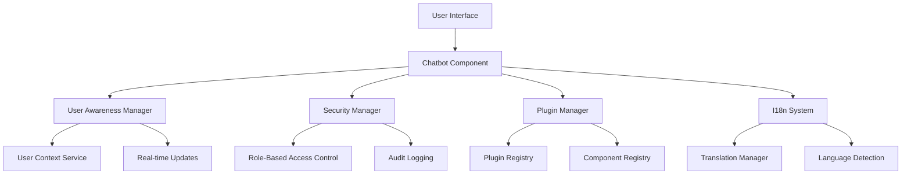

# User-Aware Chatbot System Documentation

## Overview

This documentation covers the comprehensive user-aware chatbot system implementation for the RailMadad platform. The system provides intelligent, context-aware interactions that adapt to user roles, capabilities, and preferences while maintaining security, accessibility, and performance standards.

## Table of Contents

1. [System Architecture](#system-architecture)
2. [Core Components](#core-components)
3. [User Context Management](#user-context-management)
4. [Security Framework](#security-framework)
5. [Plugin Architecture](#plugin-architecture)
6. [Internationalization](#internationalization)
7. [Accessibility Features](#accessibility-features)
8. [Performance Optimization](#performance-optimization)
9. [Testing Strategy](#testing-strategy)
10. [Deployment Guide](#deployment-guide)
11. [API Reference](#api-reference)
12. [Troubleshooting](#troubleshooting)

## System Architecture

### High-Level Overview



### Core Principles

1. **User-Centric Design**: All features adapt to user context, role, and capabilities
2. **Security First**: Comprehensive security validation and audit logging
3. **Accessibility**: Full WCAG 2.1 AA compliance with enhanced features
4. **Performance**: Sub-50ms response times for context updates
5. **Extensibility**: Plugin architecture for future enhancements
6. **Internationalization**: Support for 12+ languages with RTL layout

## Core Components

### Chatbot Component (`components/Chatbot.tsx`)

The main chatbot interface that provides user-aware interactions.

**Key Features:**
- Dynamic UI adaptation based on user role
- Real-time context synchronization
- Authentication state management
- Accessibility compliance
- Multilingual support

**Props:**
```typescript
interface ChatbotProps {
  userContext: UserContext | null;
  requireAuthentication?: boolean;
  onAuthRequired?: () => void;
  className?: string;
}
```

### UserAwarenessManager (`utils/userAwarenessManager.ts`)

Central manager for user context state and real-time updates.

**Capabilities:**
- Context subscription and notifications
- Debounced updates for performance
- Memory management and cleanup
- Performance monitoring
- Error recovery

**Usage:**
```typescript
const manager = UserAwarenessManager.getInstance();
const unsubscribe = manager.subscribe('component-id', (context) => {
  // Handle context updates
});
```

### SecurityManager (`utils/securityManager.ts`)

Comprehensive security framework with RBAC and audit logging.

**Features:**
- Role-based access control
- Capability validation
- Input sanitization
- Session management
- Audit trail

**Example:**
```typescript
const validation = securityManager.validateAccess(
  userContext,
  { requiredCapabilities: ['VIEW_COMPLAINTS'] },
  'complaints-resource',
  'read'
);
```

## User Context Management

### UserContext Interface

```typescript
interface UserContext {
  isAuthenticated: boolean;
  user: {
    id: string;
    email: string;
    fullName: string;
    profilePicture: string | null;
    department: string;
  };
  role: Role;
  sessionInfo: SessionInfo;
  capabilities: string[];
  preferences: UserPreferences;
  metadata: ContextMetadata;
  lastActivity: Date;
}
```

### Role-Based Features

The system supports multiple user roles with specific capabilities:

- **Passenger**: View complaints, create tickets, track status
- **Railway Official**: Manage complaints, access reports, user assistance
- **Admin**: Full system access, user management, system configuration

### Context Lifecycle

1. **Initialization**: Context loaded from authentication provider
2. **Updates**: Real-time synchronization across components
3. **Validation**: Security checks and capability verification
4. **Persistence**: User preferences saved to localStorage
5. **Cleanup**: Memory management and subscription cleanup

## Security Framework

### Role-Based Access Control (RBAC)

```typescript
// Define security policies
const SECURITY_POLICIES = {
  PUBLIC_READ: {
    allowUnauthenticated: true,
    dataClassification: 'public',
    auditLevel: 'basic'
  },
  USER_WRITE: {
    requiredCapabilities: ['CREATE_COMPLAINT'],
    dataClassification: 'internal',
    auditLevel: 'detailed'
  }
};

// Validate access
const { isAuthorized } = useSecurity(userContext, {
  resource: 'complaints',
  policy: SECURITY_POLICIES.USER_WRITE
});
```

### Input Sanitization

All user inputs are automatically sanitized to prevent XSS and injection attacks:

```typescript
const sanitized = securityManager.sanitizeInput(userInput, 'html');
```

### Audit Logging

Comprehensive audit trail for security monitoring:

```typescript
const auditEvents = securityManager.getAuditTrail({
  userId: userContext.user.id,
  fromDate: new Date(Date.now() - 24 * 60 * 60 * 1000)
});
```

## Plugin Architecture

### Plugin Development

Create extensible plugins for new features:

```typescript
const myPlugin: Plugin = {
  metadata: {
    id: 'my-plugin',
    name: 'My Plugin',
    version: '1.0.0',
    description: 'Custom functionality',
    author: 'Developer',
    category: 'utility',
    supportedRoles: ['passenger', 'railway_official']
  },
  config: {
    enabled: true,
    settings: {}
  },
  hooks: {
    onUserContextChange: (context) => {
      // Handle context changes
    }
  },
  initialize: async (api, config) => {
    // Plugin initialization
  }
};
```

### Plugin Management

Use the plugin management hooks:

```typescript
const { 
  plugins, 
  availablePlugins, 
  togglePlugin, 
  updatePluginConfig 
} = usePlugins(userContext);
```

## Internationalization

### Language Support

The system supports 12 languages with full localization:

- English (en) - Default
- Spanish (es)
- French (fr)
- German (de)
- Italian (it)
- Portuguese (pt)
- Dutch (nl)
- Hindi (hi)
- Arabic (ar) - RTL support
- Chinese Simplified (zh-CN)
- Japanese (ja)
- Russian (ru)

### Translation Usage

```typescript
const { t, language, setLanguage } = useUserAwareTranslation(userContext);

// Simple translation
const greeting = t('user.greeting');

// Parametrized translation
const welcome = t('user.welcomeMessage', { name: user.fullName });

// Pluralization
const itemCount = t('common.itemCount', count, { count });
```

### RTL Support

Automatic layout adjustment for RTL languages:

```typescript
const isRTL = ['ar', 'he', 'fa'].includes(language);
<div dir={isRTL ? 'rtl' : 'ltr'} className={isRTL ? 'rtl' : ''}>
```

## Accessibility Features

### WCAG 2.1 AA Compliance

- **Keyboard Navigation**: Full keyboard accessibility
- **Screen Reader Support**: ARIA labels and announcements
- **High Contrast**: Support for high contrast themes
- **Reduced Motion**: Respects user motion preferences
- **Focus Management**: Logical focus order and visible indicators

### Accessibility Hooks

```typescript
const {
  announceToScreenReader,
  manageFocus,
  preferenceManager
} = useUserAwarenessAccessibility(userContext);

// Announce important updates
announceToScreenReader('New message received', 'polite');

// Manage focus for dynamic content
manageFocus('message-input');
```

### Accessibility Testing

Automated accessibility testing is included:

```typescript
import { axe, toHaveNoViolations } from 'jest-axe';

test('chatbot should be accessible', async () => {
  const { container } = render(<Chatbot userContext={mockContext} />);
  const results = await axe(container);
  expect(results).toHaveNoViolations();
});
```

## Performance Optimization

### Performance Targets

- **Context Updates**: < 50ms
- **Component Rendering**: < 16ms (60fps)
- **Memory Usage**: Stable under continuous use
- **Bundle Size**: Optimized with code splitting

### Optimization Techniques

1. **Memoization**: React.memo and useMemo for expensive calculations
2. **Debouncing**: Rapid updates debounced to prevent thrashing
3. **Code Splitting**: Dynamic imports for plugin system
4. **Caching**: Intelligent caching of user preferences and translations
5. **Memory Management**: Automatic cleanup of subscriptions and listeners

### Performance Monitoring

```typescript
const { 
  getPerformanceMetrics, 
  enableMonitoring 
} = usePerformanceMonitoring();

// Enable real-time monitoring
enableMonitoring({
  contextUpdates: true,
  memoryUsage: true,
  renderTimes: true
});
```

## Testing Strategy

### Test Coverage

- **Unit Tests**: 95%+ coverage for core utilities
- **Integration Tests**: End-to-end user flows
- **Accessibility Tests**: WCAG compliance validation
- **Performance Tests**: Timing and memory requirements
- **Security Tests**: Vulnerability scanning and validation

### Running Tests

```bash
# Run all tests
npm test

# Run specific test suites
npm run test:unit
npm run test:integration
npm run test:accessibility
npm run test:performance

# Generate coverage report
npm run test:coverage
```

### Test Utilities

Comprehensive test utilities are provided:

```typescript
import { 
  mockUserContext, 
  mockAdminContext, 
  createPerformanceThreshold,
  measurePerformance 
} from './__tests__/setup';
```

## Deployment Guide

### Environment Setup

1. **Dependencies**: Install required packages
2. **Environment Variables**: Configure authentication and API endpoints
3. **Build Configuration**: Optimize for production
4. **CDN Setup**: Configure for static assets
5. **Monitoring**: Set up performance and error monitoring

### Build Process

```bash
# Install dependencies
npm install

# Run type checking
npm run typecheck

# Run tests
npm run test

# Build for production
npm run build

# Preview production build
npm run preview
```

### Environment Variables

```env
# Authentication
VITE_SUPABASE_URL=your_supabase_url
VITE_SUPABASE_ANON_KEY=your_supabase_key

# API Configuration
VITE_API_BASE_URL=https://api.railmadad.com
VITE_GEMINI_API_KEY=your_gemini_key

# Feature Flags
VITE_ENABLE_PLUGINS=true
VITE_ENABLE_ANALYTICS=true

# Performance Monitoring
VITE_PERFORMANCE_MONITORING=true
```

### Production Checklist

- [ ] All tests passing
- [ ] Security audit completed
- [ ] Performance benchmarks met
- [ ] Accessibility validation passed
- [ ] Internationalization tested
- [ ] Error monitoring configured
- [ ] CDN configured for assets
- [ ] Environment variables set
- [ ] SSL certificate installed
- [ ] Backup procedures in place

## API Reference

### Core Classes

#### UserAwarenessManager

```typescript
class UserAwarenessManager {
  static getInstance(): UserAwarenessManager
  subscribe(id: string, callback: (context: UserContext) => void): () => void
  updateContext(context: UserContext): Promise<void>
  getCurrentContext(): UserContext | null
  getSubscriberCount(): number
}
```

#### SecurityManager

```typescript
class SecurityManager {
  static getInstance(): SecurityManager
  validateAccess(context: UserContext, policy: SecurityPolicy, resource: string, action: string): ValidationResult
  sanitizeInput(input: any, type?: string): any
  getAuditTrail(filters: AuditFilters): AuditEvent[]
}
```

#### PluginManager

```typescript
class PluginManager {
  static getInstance(): PluginManager
  registerPlugin(plugin: Plugin): Promise<boolean>
  activatePlugin(pluginId: string): Promise<boolean>
  deactivatePlugin(pluginId: string): Promise<boolean>
  getAllPlugins(): Plugin[]
  getComponent(name: string): React.ComponentType<any> | undefined
}
```

### React Hooks

#### useUserAwareTranslation

```typescript
function useUserAwareTranslation(userContext: UserContext | null): {
  t: (key: string, ...args: any[]) => string;
  language: string;
  setLanguage: (lang: string) => void;
  isRTL: boolean;
}
```

#### useSecurity

```typescript
function useSecurity(userContext: UserContext | null, options: UseSecurityOptions): {
  isAuthorized: boolean;
  validateAction: (action: string) => ValidationResult;
  executeSecureAction: <T>(action: string, fn: () => T) => Promise<T>;
  sanitizeInput: (input: any) => any;
}
```

#### usePlugins

```typescript
function usePlugins(userContext: UserContext | null, options?: UsePluginsOptions): {
  plugins: Plugin[];
  availablePlugins: Plugin[];
  loading: boolean;
  togglePlugin: (pluginId: string) => Promise<void>;
  updatePluginConfig: (pluginId: string, config: PluginConfig) => Promise<void>;
}
```

## Troubleshooting

### Common Issues

#### Context Not Updating

**Symptoms**: UI not reflecting user context changes
**Solution**: Check subscription cleanup and memory management

```typescript
// Ensure proper cleanup
useEffect(() => {
  const unsubscribe = manager.subscribe('component-id', callback);
  return unsubscribe; // Important!
}, []);
```

#### Performance Issues

**Symptoms**: Slow context updates or UI lag
**Solution**: Enable performance monitoring and check for memory leaks

```typescript
// Check performance metrics
const metrics = manager.getPerformanceMetrics();
console.log('Context update time:', metrics.averageUpdateTime);
```

#### Security Validation Failing

**Symptoms**: Unexpected access denied errors
**Solution**: Verify user capabilities and security policies

```typescript
// Debug security validation
const validation = securityManager.validateAccess(context, policy, resource, action);
console.log('Validation result:', validation);
```

#### Translation Not Working

**Symptoms**: Keys showing instead of translated text
**Solution**: Check language file loading and key existence

```typescript
// Debug translation
console.log('Current language:', language);
console.log('Available translations:', getAvailableTranslations());
```

### Debug Tools

#### System Validation

```typescript
import { systemValidator } from './utils/systemValidator';

// Run complete health check
const healthCheck = await systemValidator.runSystemHealthCheck();
console.log(systemValidator.generateReport(healthCheck));
```

#### Performance Monitoring

```typescript
// Enable detailed performance monitoring
manager.configure({
  enablePerformanceMonitoring: true,
  performanceThresholds: {
    contextUpdate: 30,
    notification: 10
  }
});
```

### Support and Maintenance

For ongoing support and maintenance:

1. **Monitoring**: Set up automated health checks
2. **Updates**: Regular dependency updates and security patches
3. **Performance**: Continuous performance monitoring
4. **User Feedback**: Collect and analyze user feedback
5. **Analytics**: Monitor usage patterns and feature adoption

---

## Conclusion

This user-aware chatbot system provides a robust, secure, and accessible foundation for intelligent user interactions. The modular architecture ensures maintainability and extensibility while meeting strict performance and security requirements.

For additional support or questions, please refer to the troubleshooting section or contact the development team.